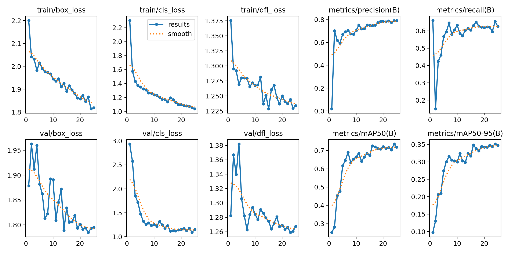
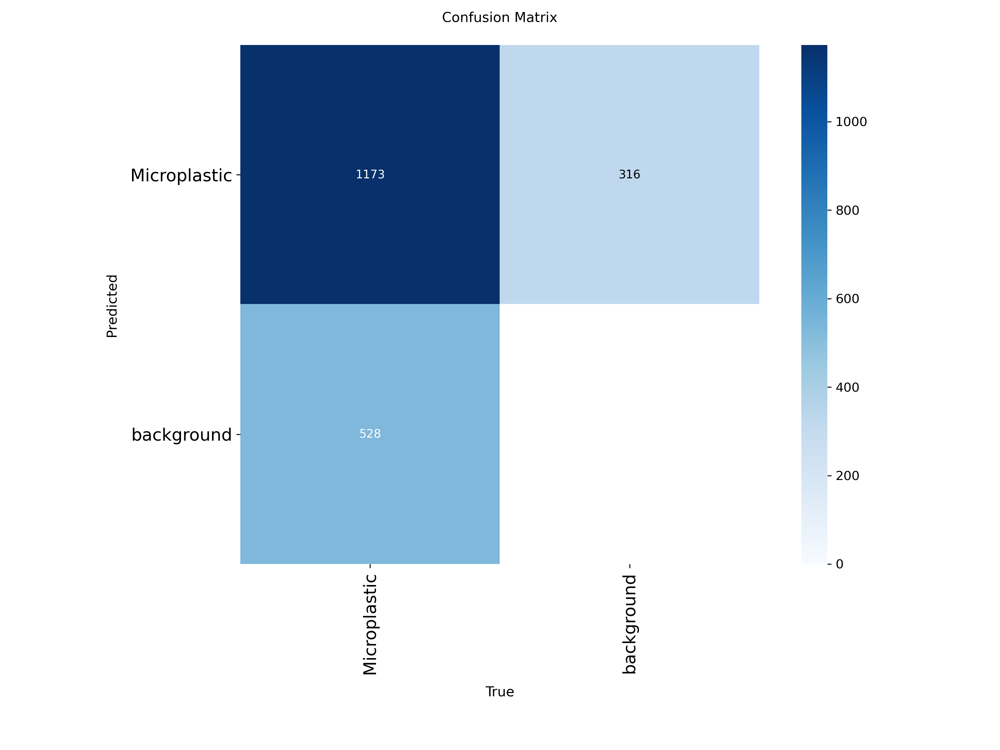

# AI-Powered Microplastic Detection using YOLOv8

## Project Overview

Microplastic pollution is a growing global environmental concern affecting marine ecosystems and human health. Traditional microscopic inspection methods for detecting microplastics are time-consuming and prone to human error.

This project presents a deep learning-based object detection system using YOLOv8 to automatically detect and localize microplastic particles in microscopic water sample images.

##  Technical Approach

- Architecture: YOLOv8 (Nano & Small variants)
- Task: Single-class object detection
- Framework: PyTorch (Ultralytics)
- Annotation Format: YOLO bounding box format
- Dataset: Public microplastic microscopy dataset

##  Performance Results

| Model | Precision | Recall | mAP@0.5 | mAP@0.5–0.95 |
|-------|-----------|--------|----------|--------------|
| YOLOv8n | 0.79 | 0.64 | 0.73 | 0.35 |
| YOLOv8s | 0.81 | 0.63 | 0.72 | 0.34 |

- Real-time inference speed (~6–7 ms per image)
- Accurate localization of small microplastic particles
- Evaluation includes PR curves and confusion matrix

##  How to Run

### Install Dependencies

pip install -r requirements.txt

### Train Model

yolo detect train data=microplastic.yaml model=yolov8n.pt epochs=25 imgsz=640

### Run Inference

yolo detect predict model=best.pt source=images/

##  Sample Detection Output

##  Training Results

##  Confusion Matrix

##  Research Contribution

This project demonstrates the feasibility of automated microplastic detection using deep learning-based object detection models. The approach enables scalable environmental monitoring and supports sustainability-focused research initiatives.
